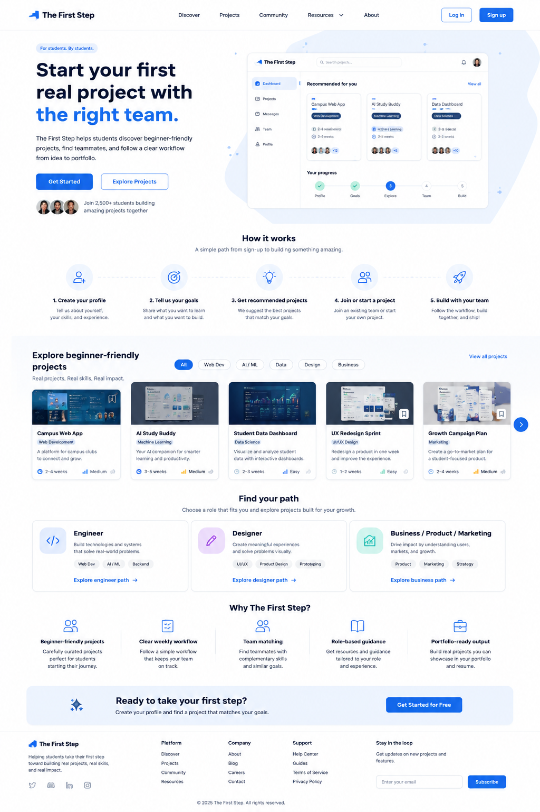

# Landing Page Handoff

## Features We Need on This Page

* Header / Navigation
* Hero section
* Main CTA buttons
* Product preview image
* How it works section
* Featured project cards
* Role path section
* Why The First Step section
* Final CTA section
* Footer

---

## 1. Header / Navigation

### Needed elements

* Logo: The First Step
* Navigation links:

  * Discover
  * Projects
  * Community
  * Resources
  * About
* Log in button
* Sign up button

### Notes

The `Sign up` button should be the main action in the header.

---

## 2. Hero Section

### Needed elements

* Main headline
* Short description
* Primary CTA button
* Secondary CTA button
* Small social proof text
* Product/dashboard preview image

### Suggested copy

Headline:

```text
Start your first real project with the right team.
```

Description:

```text
The First Step helps students discover beginner-friendly projects, find teammates, and follow a clear workflow from idea to portfolio.
```

Buttons:

* Get Started
* Explore Projects

Social proof text:

```text
Join students building real projects together.
```

---

## 3. Product Preview Image

### Needed elements

* Dashboard preview
* Recommended project cards
* Progress / workflow preview
* Clean card-based UI

### Notes

This can be a static visual in the first version.

---

## 4. How It Works Section

### Steps

1. Create your profile
2. Tell us your goals
3. Get recommended projects
4. Join or start a project
5. Build with your team

### Needed elements

Each step should include:

* Icon
* Short title
* One short description

---

## 5. Featured Projects Section

### Needed elements

* Section title
* Category filter tabs
* Project cards
* View all projects link/button

### Project card fields

Each project card should include:

* Project image
* Project title
* Category
* Short description
* Estimated duration
* Difficulty
* Optional bookmark icon

### Example projects

* Campus Web App
* AI Study Buddy
* Student Data Dashboard
* UX Redesign Sprint
* Growth Campaign Plan

---

## 6. Role Paths Section

### Needed role cards

* Engineer
* Designer
* Business / Product / Marketing

### Each role card should include

* Role name
* Short description
* Skill tags
* CTA link

Example CTA:

```text
Explore engineer path →
```

---

## 7. Why The First Step Section

### Needed points

* Beginner-friendly projects
* Clear weekly workflow
* Team matching
* Role-based guidance
* Portfolio-ready output

### Notes

This section should be easy to scan with short text, icons, and simple cards.

---

## 8. Final CTA Section

### Needed elements

* Short headline
* Short supporting text
* CTA button

### Suggested copy

Headline:

```text
Ready to take your first step?
```

Description:

```text
Create your profile and find a project that matches your goals.
```

Button:

```text
Get Started for Free
```

---

## 9. Footer

### Needed elements

* Logo
* Short product description
* Platform links
* Company links
* Support links
* Email subscribe input

---

## Design Direction for Landing Page

The Landing Page should feel:

* Clean
* Student-friendly
* Trustworthy
* Beginner-friendly
* Modern
* Project-focused

### Visual style

* White background
* Blue primary color
* Light gray section backgrounds
* Rounded project cards
* Simple navigation
* Clear CTA buttons
* Spacious layout
* Easy-to-read text
