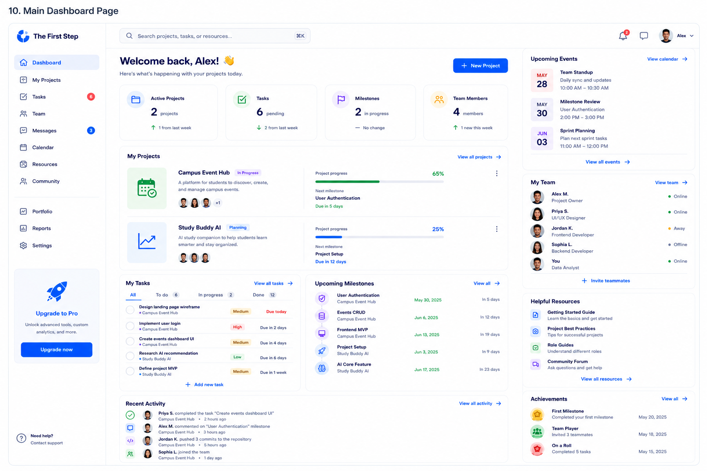

# Main Dashboard Page Handoff



## Features We Need on This Page

* Sidebar navigation
* Top search bar
* Notification / message icons
* User account menu
* Welcome section
* Summary stats cards
* My Projects section
* Project progress cards
* My Tasks section
* Upcoming Milestones section
* Recent Activity section
* Upcoming Events sidebar
* My Team sidebar
* Helpful Resources sidebar
* Achievements sidebar
* New Project CTA

---

## 1. Sidebar Navigation

### Needed elements

* Logo: The First Step
* Navigation links:

  * Dashboard
  * My Projects
  * Tasks
  * Team
  * Messages
  * Calendar
  * Resources
  * Community
  * Portfolio
  * Reports
  * Settings
* Upgrade card
* Help / support link

### Notes

The current page should be highlighted as `Dashboard`.

---

## 2. Top Header

### Needed elements

* Search bar
* Notification icon
* Message icon
* User avatar
* User name
* Account dropdown

### Suggested search placeholder

```text
Search projects, tasks, or resources...
```

### Notes

This header should help users quickly find projects, tasks, and resources.

---

## 3. Welcome Section

### Needed elements

* Welcome message
* Short description
* New Project button

### Suggested copy

Headline:

```text
Welcome back, Alex! 👋
```

Description:

```text
Here's what's happening with your projects today.
```

Button:

```text
New Project
```

---

## 4. Summary Stats Cards

### Needed cards

* Active Projects
* Tasks
* Milestones
* Team Members

### Example values

* Active Projects: 2 projects
* Tasks: 6 pending
* Milestones: 2 in progress
* Team Members: 4 members

### Notes

These cards give users a quick overview of their current project status.

---

## 5. My Projects Section

### Needed elements

* Section title
* View all projects link
* Project progress cards

### Project card fields

Each project card should include:

* Project icon or thumbnail
* Project name
* Project status
* Short description
* Team member avatars
* Project progress percentage
* Progress bar
* Next milestone
* Due date
* More options menu

### Example projects

* Campus Event Hub
* Study Buddy AI

---

## 6. My Tasks Section

### Needed elements

* Section title
* Task status tabs
* Task list
* Add new task button
* View all tasks link

### Suggested tabs

* All
* To do
* In progress
* Done

### Task fields

Each task should include:

* Checkbox
* Task title
* Related project
* Priority label
* Due date

### Example tasks

* Design landing page wireframe
* Implement user login
* Create events dashboard UI
* Research AI recommendation
* Define project MVP

---

## 7. Upcoming Milestones Section

### Needed elements

* Section title
* View all link
* Milestone list

### Milestone fields

Each milestone should include:

* Milestone title
* Related project
* Date
* Time remaining
* Icon or status indicator

### Example milestones

* User Authentication
* Events CRUD
* Frontend MVP
* Project Setup
* AI Core Feature

---

## 8. Recent Activity Section

### Needed elements

* Section title
* View all activity link
* Activity feed

### Activity fields

Each activity item should include:

* User avatar or icon
* User name
* Action
* Related project
* Time

### Example activities

* Priya S. completed the task “Create events dashboard UI”
* Alex M. commented on “User Authentication” milestone
* Jordan K. pushed 3 commits to the repository
* Sophia L. joined the team

---

## 9. Upcoming Events Sidebar

### Needed elements

* Section title
* View calendar link
* Event list

### Event fields

Each event should include:

* Date
* Event title
* Short description
* Time

### Example events

* Team Standup
* Milestone Review
* Sprint Planning

---

## 10. My Team Sidebar

### Needed elements

* Section title
* View team link
* Team member list
* Invite teammates button

### Team member fields

Each member should include:

* Avatar
* Name
* Role
* Online status

### Example roles

* Project Owner
* UI/UX Designer
* Frontend Developer
* Backend Developer
* Data Analyst

---

## 11. Helpful Resources Sidebar

### Needed elements

* Section title
* Resource list
* View all resources link

### Example resources

* Getting Started Guide
* Project Best Practices
* Role Guides
* Community Forum

---

## 12. Achievements Sidebar

### Needed elements

* Section title
* View all link
* Achievement list

### Achievement fields

Each achievement should include:

* Badge icon
* Achievement title
* Short description
* Date

### Example achievements

* First Milestone
* Team Player
* On a Roll

---

## 13. New Project CTA

### Needed elements

* Primary button

### Button text

```text
New Project
```

### Notes

This button should allow users to create or start a new project.

---

## Design Direction for Main Dashboard Page

The Main Dashboard Page should feel:

* Organized
* Productive
* Friendly
* Motivating
* Easy to scan
* Project-focused

### Visual style

* White background
* Blue primary actions
* Light gray page background
* Rounded dashboard cards
* Clean sidebar navigation
* Progress bars
* Status labels
* Team avatars
* Soft borders
* Consistent with previous pages
