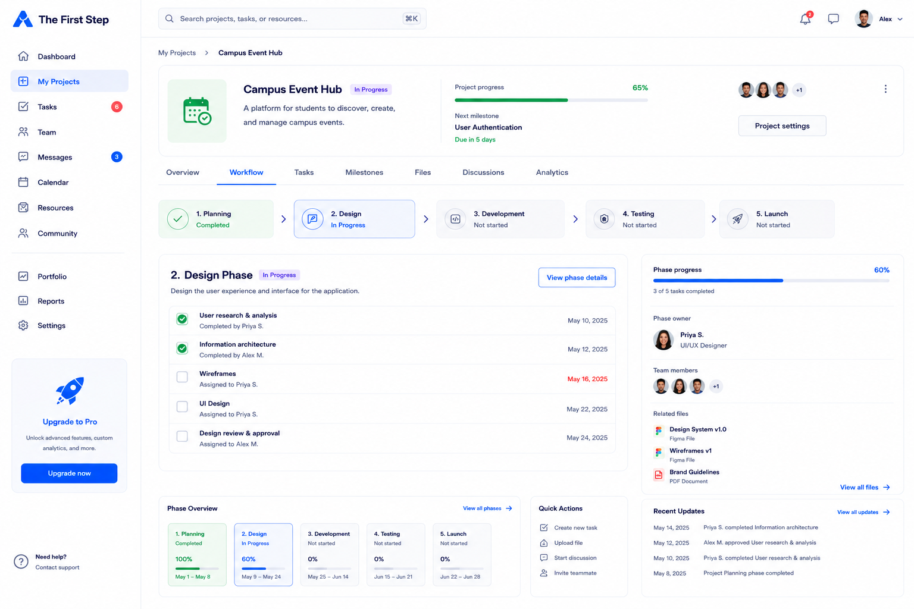

# Project Workflow Page Handoff



## Features We Need on This Page

* Sidebar navigation
* Top search bar
* Notification / message icons
* User account menu
* Project overview header
* Project progress summary
* Project navigation tabs
* Workflow phase tracker
* Current phase task list
* Phase progress sidebar
* Phase owner and team members
* Related files section
* Phase overview section
* Quick actions section
* Recent updates section
* Help card

---

## 1. Sidebar Navigation

### Needed elements

* Logo: The First Step
* Navigation links:

  * Dashboard
  * My Projects
  * Tasks
  * Team
  * Messages
  * Calendar
  * Resources
  * Community
  * Portfolio
  * Reports
  * Settings
* Upgrade card
* Help / support link

### Notes

The current section should be highlighted as `My Projects`.

---

## 2. Top Header

### Needed elements

* Search bar
* Notification icon
* Message icon
* User avatar
* User name
* Account dropdown

### Suggested search placeholder

```text id="v2juei"
Search projects, tasks, or resources...
```

---

## 3. Project Overview Header

### Needed elements

* Breadcrumb
* Project icon or thumbnail
* Project name
* Project status
* Short project description
* Project progress percentage
* Progress bar
* Next milestone
* Team member avatars
* Project settings button
* More options menu

### Suggested example

Project name:

```text id="1v6t7s"
Campus Event Hub
```

Status:

```text id="srsmnb"
In Progress
```

Description:

```text id="l2y7w0"
A platform for students to discover, create, and manage campus events.
```

Progress:

```text id="9qwgj2"
65%
```

Next milestone:

```text id="p1duh8"
User Authentication
Due in 5 days
```

---

## 4. Project Navigation Tabs

### Needed tabs

* Overview
* Workflow
* Tasks
* Milestones
* Files
* Discussions
* Analytics

### Notes

The current tab should be highlighted as `Workflow`.

---

## 5. Workflow Phase Tracker

### Needed phases

1. Planning
2. Design
3. Development
4. Testing
5. Launch

### Needed state labels

* Completed
* In Progress
* Not started

### Notes

This section should show where the project currently is.

Example:

* Planning: Completed
* Design: In Progress
* Development: Not started
* Testing: Not started
* Launch: Not started

---

## 6. Current Phase Section

### Needed elements

* Current phase title
* Current phase status
* Short phase description
* View phase details button
* Task list

### Suggested copy

Title:

```text id="haw34m"
2. Design Phase
```

Status:

```text id="qytazw"
In Progress
```

Description:

```text id="85vya4"
Design the user experience and interface for the application.
```

Button:

```text id="cow14s"
View phase details
```

---

## 7. Current Phase Task List

### Needed task fields

Each task should include:

* Checkbox or completion status
* Task title
* Assignee
* Due date
* Completed state

### Example tasks

* User research & analysis
* Information architecture
* Wireframes
* UI Design
* Design review & approval

### Notes

Completed tasks should have a checked state.
Upcoming tasks should show due dates clearly.

---

## 8. Phase Progress Sidebar

### Needed elements

* Phase progress percentage
* Progress bar
* Completed task count
* Phase owner
* Team members
* Related files

### Example values

Progress:

```text id="5ox0np"
60%
```

Completed tasks:

```text id="2g7unx"
3 of 5 tasks completed
```

Phase owner:

```text id="od5wyj"
Priya S.
UI/UX Designer
```

---

## 9. Related Files Section

### Needed fields

Each file item should include:

* File icon
* File name
* File type

### Example files

* Design System v1.0
* Wireframe v1
* Brand Guidelines

### Notes

This helps teammates find important project documents.

---

## 10. Phase Overview Section

### Needed elements

* Phase cards for each workflow stage
* Progress percentage
* Date range
* Status

### Example phase cards

* Planning — 100% — May 1–May 8
* Design — 60% — May 9–May 24
* Development — 0% — May 25–Jun 14
* Testing — 0% — Jun 15–Jun 21
* Launch — 0% — Jun 22–Jun 28

---

## 11. Quick Actions Section

### Needed actions

* Create new task
* Upload file
* Start discussion
* Invite teammate

### Notes

These should be quick links/buttons that help the team take action without leaving the page.

---

## 12. Recent Updates Section

### Needed fields

Each update should include:

* Date
* User name
* Action taken
* Related task or phase

### Example updates

* Priya S. completed Information architecture
* Alex M. approved User research & analysis
* Priya S. completed User research & analysis
* Project Planning phase completed

---

## 13. Help Card

### Needed elements

* Short help message
* CTA button

### Suggested copy

Title:

```text id="7x3s3f"
Need help?
```

Description:

```text id="0kj7qq"
Stuck on something? Get help from your team or the community.
```

Button:

```text id="rzejdf"
Ask for help
```

---

## Design Direction for Project Workflow Page

The Project Workflow Page should feel:

* Structured
* Productive
* Team-focused
* Beginner-friendly
* Progress-oriented
* Easy to follow

### Visual style

* White background
* Blue active states
* Green completed states
* Rounded workflow cards
* Clear progress bars
* Checkbox-style task lists
* Simple sidebar navigation
* Soft borders
* Team avatars
* Consistent with the Main Dashboard Page
