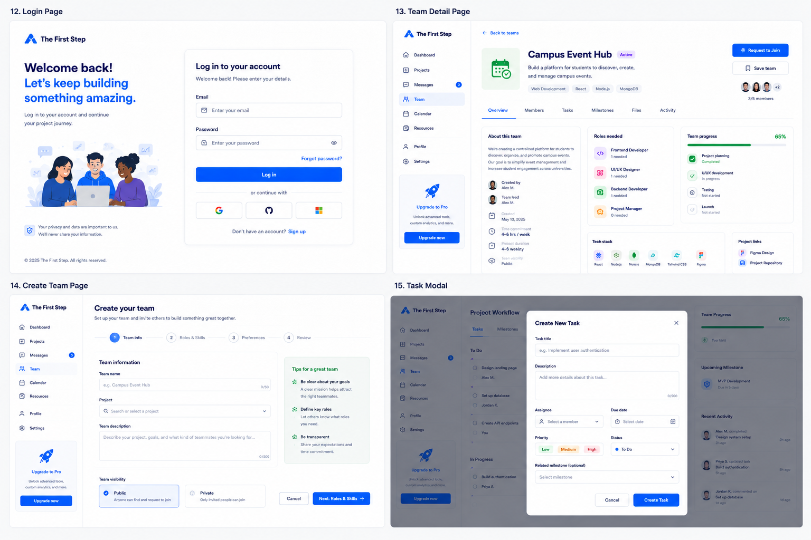

# Developer Handoff: Pages 12–15



## Overview

This handoff covers the additional pages/components needed to support the core user journey after onboarding and project discovery.

Pages included:

1. Login Page
2. Team Detail Page
3. Create Team Page
4. Task Modal

These pages support returning users, team evaluation, team creation, and project workflow/task management.

---

# 12. Login Page

## Purpose

Allow returning users to access their account and continue their project journey.

## Route

`/login`

## User Flow

Landing Page  
→ Click “Log in”  
→ Login Page  
→ Successful login  
→ Main Dashboard Page

If the user does not have an account:

Login Page  
→ Click “Sign up”  
→ Create Account Page

If the user forgot their password:

Login Page  
→ Click “Forgot password?”  
→ Forgot Password Page / Modal

For MVP, forgot password can be a placeholder.

---

## Layout

### Left Side

Contains brand message and illustration.

Text:

> Welcome back!  
> Let’s keep building something amazing.  
>
> Log in to your account and continue your project journey.

Footer note:

> Your privacy and data are important to us.  
> We’ll never share your information.

### Right Side

Login form card.

Fields:

- Email
- Password

Actions:

- Log in
- Forgot password?
- Continue with Google
- Continue with GitHub
- Continue with Microsoft
- Sign up

---

## Components Needed

- AuthLayout
- LoginForm
- TextInput
- PasswordInput
- PrimaryButton
- SocialLoginButton
- BrandIllustration

---

## Data Needed

```js
LoginPayload {
  email: string,
  password: string
}
```

---

## Acceptance Criteria

- [ ] Page is available at `/login`
- [ ] User can enter email and password
- [ ] Password field hides/shows password
- [ ] Log in button is disabled when fields are empty
- [ ] Successful login redirects to dashboard
- [ ] Sign up link redirects to create account page
- [ ] Forgot password link exists
- [ ] Page is responsive

---

# 13. Team Detail Page

## Purpose

Let users review a team before requesting to join.

This page answers:

> Is this team a good fit for me?

## Route

`/teams/:teamId`

Example:

`/teams/campus-event-hub-team-1`

---

## User Flow

Join or Start Project Page  
→ Click “View Team”  
→ Team Detail Page  
→ Click “Request to Join”  
→ Request sent state

Alternative flow:

Find Teammates Page  
→ View project/team context  
→ Team Detail Page

---

## Main Information

### Header

- Back to teams
- Campus Event Hub
- Status: Active
- Project category: Web Development
- Tech stack: React, Node.js, MongoDB
- Team size: 3/5 members

Primary actions:

- Request to Join
- Save team

---

## Tabs

- Overview
- Members
- Tasks
- Milestones
- Files
- Activity

For MVP, only the `Overview` tab needs to be functional. Other tabs can be placeholders.

---

## Overview Sections

### About This Team

Shows team description.

Example:

> We’re creating a centralized platform for students to discover, organize, and promote campus events. Our goal is to simplify event management and increase student engagement across universities.

Metadata:

- Created by
- Created date
- Time commitment
- Project duration
- Visibility

---

### Roles Needed

Example:

- Frontend Developer — 1 needed
- UI/UX Designer — 1 needed
- Backend Developer — 1 needed
- Project Manager — 0 needed

---

### Team Progress

Example:

- Project planning — Completed
- UI/UX development — In progress
- Testing — Not started
- Launch — Not started

Progress bar:

`65%`

---

### Tech Stack

- React
- Node.js
- MongoDB
- Tailwind CSS
- Figma

---

### Project Links

- Figma Demo
- Project Repository

---

## Components Needed

- DashboardSidebar
- TeamHeader
- TeamTabs
- TeamOverviewCard
- RolesNeededCard
- TeamProgressCard
- TechStackList
- ProjectLinksCard
- MemberAvatarGroup
- SecondaryButton
- PrimaryButton

---

## Data Needed

```js
Team {
  id: string,
  projectId: string,
  name: string,
  status: "active" | "forming" | "completed",
  description: string,
  createdBy: User,
  createdAt: string,
  members: User[],
  rolesNeeded: RoleNeed[],
  techStack: string[],
  progress: number,
  milestones: Milestone[],
  links: ProjectLink[],
  visibility: "public" | "private"
}

RoleNeed {
  role: string,
  count: number
}

ProjectLink {
  label: string,
  url: string,
  type: "figma" | "github" | "document" | "other"
}
```

---

## Button States

### Request to Join

Before request:

`Request to Join`

After request:

`Request Sent`

If already a member:

`Go to Workspace`

If team is full:

`Team Full`

---

## Acceptance Criteria

- [ ] Page is available at `/teams/:teamId`
- [ ] Team name, project, status, and team size are displayed
- [ ] User can see roles needed
- [ ] User can see team progress
- [ ] User can click Request to Join
- [ ] Request button changes to Request Sent after clicked
- [ ] Save team button exists
- [ ] Overview tab is functional
- [ ] Page is responsive

---

# 14. Create Team Page

## Purpose

Allow a user to start their own team for a selected project.

This page is used after the user chooses:

> Start your own team

---

## Route

`/projects/:projectId/create-team`

Example:

`/projects/campus-event-hub/create-team`

---

## User Flow

Project Detail Page  
→ I’m interested  
→ Join or Start Project Page  
→ Start your own team  
→ Create Team Page  
→ Create team  
→ Team Detail Page / Dashboard

---

## Page Structure

This page uses a multi-step form.

- Step 1: Team Info
- Step 2: Roles & Skills
- Step 3: Preferences
- Step 4: Review

The current design shows:

- Step 1: Team Info

---

## Step 1: Team Info

Fields:

- Team name
- Project
- Team description
- Team visibility

Team visibility options:

- Public
- Private

### Public

Anyone can find and request to join.

### Private

Only invited people can join.

---

## Right Side Helper Card

Title:

> Tips for a great team

Tips:

- Be clear about your goals
- Define roles
- Be transparent

---

## Components Needed

- DashboardSidebar
- CreateTeamForm
- StepProgressBar
- TextInput
- ProjectSelect
- Textarea
- VisibilityOptionCard
- TipsCard
- PrimaryButton
- SecondaryButton

---

## Data Needed

```js
CreateTeamPayload {
  teamName: string,
  projectId: string,
  description: string,
  visibility: "public" | "private"
}
```

Later steps may add:

```js
rolesNeeded: string[],
skillsNeeded: string[],
meetingPreference: string,
timeCommitment: string
```

---

## Validation Rules

- Team name is required
- Project is required
- Description is required
- Visibility is required

Optional limits:

- Team name: max 50 characters
- Description: max 500 characters

---

## Button Behavior

Cancel → returns to Join or Start Project Page  
Next: Roles & Skills → goes to Step 2

For MVP, if Steps 2–4 are not built yet, clicking next can save Step 1 and move to a placeholder page.

---

## Acceptance Criteria

- [ ] Page is available at `/projects/:projectId/create-team`
- [ ] User can enter team name
- [ ] User can select or confirm project
- [ ] User can write team description
- [ ] User can choose public or private visibility
- [ ] Next button is disabled until required fields are complete
- [ ] Cancel button returns to previous page
- [ ] Form state is preserved while moving between steps
- [ ] Page is responsive

---

# 15. Task Modal

## Purpose

Allow users to create a task inside a project workflow.

This supports the workflow/dashboard experience.

---

## Where It Appears

The modal opens on top of the Project Workflow Page.

Possible trigger buttons:

- Create new task
- Add task
- + New task

---

## Route

No separate route required for MVP.

Use modal state.

Example:

```js
const [isTaskModalOpen, setIsTaskModalOpen] = useState(false);
```

Optional later route:

`/projects/:projectId/tasks/new`

---

## Modal Fields

- Task title
- Description
- Assignee
- Due date
- Priority
- Status
- Related milestone

---

## Options

### Priority

- Low
- Medium
- High

### Status

- To Do
- In Progress
- Done

### Assignee

Should come from current team members.

Example:

- Alex M.
- Priya S.
- Jordan K.
- You

### Related Milestone

Optional.

Example:

- Project Planning
- Design Phase
- Development Phase
- Testing
- Launch

---

## Components Needed

- TaskModal
- TextInput
- Textarea
- SelectDropdown
- DatePicker
- PrioritySelector
- StatusDropdown
- PrimaryButton
- SecondaryButton
- ModalOverlay

---

## Data Needed

```js
CreateTaskPayload {
  title: string,
  description?: string,
  assigneeId?: string,
  dueDate?: string,
  priority: "low" | "medium" | "high",
  status: "todo" | "in_progress" | "done",
  milestoneId?: string,
  projectId: string,
  teamId: string
}
```

---

## Button Behavior

Cancel → closes modal without saving  
Create Task → saves task and closes modal  
X icon → closes modal

After creating a task:

- Task appears in the correct status section
- Recent Activity updates
- Team progress may update if task completion affects progress

---

## Empty / Error States

### Required Field Missing

Please enter a task title.

### Failed to Create

Something went wrong. Please try again.

### Success

Task created successfully.

For MVP, success can simply close the modal and update the task list.

---

## Acceptance Criteria

- [ ] Modal opens from Project Workflow Page
- [ ] Background is dimmed when modal is open
- [ ] User can close modal with Cancel or X
- [ ] Task title is required
- [ ] User can select assignee
- [ ] User can select due date
- [ ] User can choose priority
- [ ] User can choose status
- [ ] User can optionally connect task to milestone
- [ ] Create Task button adds task to workflow
- [ ] Modal is responsive

---

# Suggested GitHub Issues

## Issue 12: Build Login Page

## Task

Build the Login Page.

## Route

`/login`

## Goal

Returning users should be able to log in and continue to their dashboard.

## Requirements

- Create login page layout
- Add email input
- Add password input
- Add forgot password link
- Add social login buttons
- Add sign up link
- Redirect successful login to dashboard
- Match existing First Step design style

## Acceptance Criteria

- [ ] Page is available at `/login`
- [ ] Email and password fields render correctly
- [ ] Password input hides user input
- [ ] Log in button exists
- [ ] Sign up link routes to create account page
- [ ] Forgot password link exists
- [ ] Page works on desktop and mobile

---

## Issue 13: Build Team Detail Page

## Task

Build the Team Detail Page.

## Route

`/teams/:teamId`

## Goal

Users should be able to review a team and request to join.

## Requirements

- Show team name and status
- Show project category and tech stack
- Show team size
- Show Request to Join button
- Show Save Team button
- Add tabs: Overview, Members, Tasks, Milestones, Files, Activity
- Build Overview section
- Show roles needed
- Show team progress
- Show project links

## Acceptance Criteria

- [ ] Page is available at `/teams/:teamId`
- [ ] Team information is displayed
- [ ] Roles needed card is displayed
- [ ] Team progress card is displayed
- [ ] Request to Join button works
- [ ] Request button changes state after clicked
- [ ] Overview tab works
- [ ] Page is responsive

---

## Issue 14: Build Create Team Page

## Task

Build the Create Team Page.

## Route

`/projects/:projectId/create-team`

## Goal

Users should be able to start their own team for a selected project.

## Requirements

- Add multi-step form layout
- Build Step 1: Team Info
- Add team name input
- Add project selector
- Add team description textarea
- Add public/private visibility selector
- Add tips card
- Add Cancel button
- Add Next button

## Acceptance Criteria

- [ ] Page is available at `/projects/:projectId/create-team`
- [ ] Team name input works
- [ ] Project selector works
- [ ] Description textarea works
- [ ] Public/private visibility selection works
- [ ] Next button is disabled until required fields are complete
- [ ] Cancel button returns to previous page
- [ ] Page is responsive

---

## Issue 15: Build Create Task Modal

## Task

Build the Create Task Modal.

## Location

Project Workflow Page

## Goal

Users should be able to create a new task inside their project workflow.

## Requirements

- Add modal overlay
- Add task title input
- Add description textarea
- Add assignee dropdown
- Add due date picker
- Add priority selector
- Add status dropdown
- Add related milestone dropdown
- Add Cancel and Create Task buttons

## Acceptance Criteria

- [ ] Modal opens from Project Workflow Page
- [ ] Background dims when modal is open
- [ ] User can close modal with Cancel or X
- [ ] Task title is required
- [ ] User can select assignee
- [ ] User can select due date
- [ ] User can choose priority
- [ ] User can choose status
- [ ] User can optionally select milestone
- [ ] Create Task adds task to workflow

---

# Recommended Build Order

Build in this order:

1. Login Page
2. Create Team Page
3. Team Detail Page
4. Task Modal

Reason:

- Login Page = simple and independent
- Create Team Page = needed after Join or Start
- Team Detail Page = depends on team data
- Task Modal = depends on workflow/task data

---

# Shared Components to Reuse

Engineers should not build every page from scratch.

Create or reuse these shared components:

- Button
- Input
- Textarea
- Select
- Card
- Badge
- AvatarGroup
- ProgressBar
- Sidebar
- Navbar
- Modal
- Tabs
- StatusBadge
- SkillTag

This will keep the design consistent across the app.

---

# Notes for Engineers

## Keep PRs Focused

Each PR should only solve one issue.

Good example:

`Build Login Page`

Bad example:

`Build Login Page + change dashboard + edit project page + update navbar`

## Reuse Existing Design System

Use the same:

- colors
- spacing
- font sizes
- buttons
- cards
- badges
- icons
- border radius

## MVP Rule

For the first version, prioritize:

- Clear user flow
- Working navigation
- Reusable components
- Simple fake data
- Clean file structure

Do not overbuild backend features before the frontend flow is validated.
