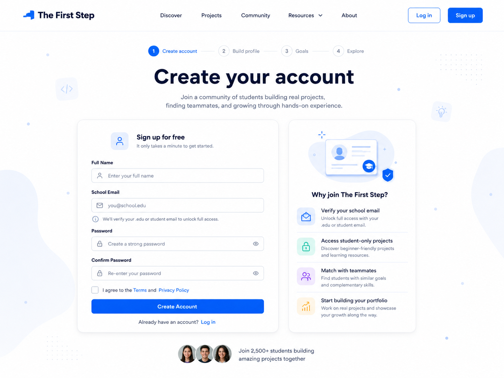

# Create Account Page Handoff



## Features We Need on This Page

* Header / Navigation
* Onboarding progress indicator
* Main page title
* Sign up form
* Terms and privacy agreement
* Create account CTA
* Login link
* Benefit / explanation card
* Social proof section

---

## 1. Header / Navigation

### Needed elements

* Logo: The First Step
* Navigation links:

  * Discover
  * Projects
  * Community
  * Resources
  * About
* Log in button
* Sign up button

### Notes

The header should stay consistent with the Landing Page design.

---

## 2. Onboarding Progress Indicator

### Needed elements

* Step 1: Create account
* Step 2: Build profile
* Step 3: Goals
* Step 4: Explore

### Notes

The current step should be visually highlighted.

For this page, `Create account` should be active.

---

## 3. Main Page Title

### Needed elements

* Main headline
* Short supporting text

### Suggested copy

Headline:

```text
Create your account
```

Description:

```text
Join a community of students building real projects, finding teammates, and growing through hands-on experience.
```

---

## 4. Sign Up Form

### Needed fields

* Full name
* School email
* Password
* Confirm password

### Notes

The form should feel simple, clean, and easy to complete.

The school email field should explain that the email may be used for student verification.

Suggested helper text:

```text
We'll verify your .edu or student email to unlock full access.
```

---

## 5. Terms and Privacy Agreement

### Needed elements

* Checkbox
* Terms link
* Privacy Policy link

### Suggested copy

```text
I agree to the Terms and Privacy Policy
```

---

## 6. Create Account CTA

### Needed elements

* Primary button

### Button text

```text
Create Account
```

### Notes

This should be the main action on the page.

After the user creates an account, they should move to the Build Profile page.

---

## 7. Login Link

### Needed elements

* Short text
* Login link

### Suggested copy

```text
Already have an account? Log in
```

---

## 8. Benefit / Explanation Card

### Needed elements

* Small visual or illustration
* Section title
* Benefit list

### Suggested title

```text
Why join The First Step?
```

### Benefit items

* Verify your school email
* Access student-only projects
* Match with teammates
* Start building your portfolio

### Notes

This card should explain why creating an account is worth it.

---

## 9. Social Proof Section

### Needed elements

* Small student avatars
* Short text

### Suggested copy

```text
Join 2,500+ students building amazing projects together
```

---

## Design Direction for Create Account Page

The Create Account Page should feel:

* Clean
* Trustworthy
* Student-friendly
* Simple
* Secure
* Easy to complete

### Visual style

* White background
* Blue primary CTA
* Light blue accent shapes
* Rounded form card
* Clear input fields
* Simple icons
* Enough spacing
* Consistent with the Landing Page
