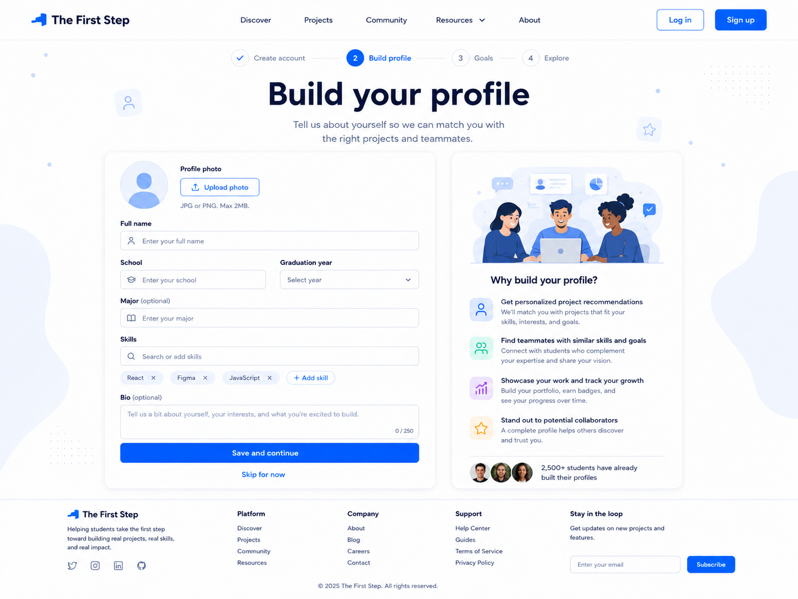

# Build Profile Page Handoff



## Features We Need on This Page

* Header / Navigation
* Onboarding progress indicator
* Main page title
* Profile photo upload
* Profile form
* Skills input
* Bio input
* Save and continue CTA
* Skip option
* Benefit / explanation card
* Footer

---

## 1. Header / Navigation

### Needed elements

* Logo: The First Step
* Navigation links:

  * Discover
  * Projects
  * Community
  * Resources
  * About
* Log in button
* Sign up button

### Notes

The header should stay consistent with the Landing Page and Create Account Page.

---

## 2. Onboarding Progress Indicator

### Needed elements

* Step 1: Create account
* Step 2: Build profile
* Step 3: Goals
* Step 4: Explore

### Notes

The current step should be visually highlighted.

For this page, `Build profile` should be active.

---

## 3. Main Page Title

### Needed elements

* Main headline
* Short supporting text

### Suggested copy

Headline:

```text
Build your profile
```

Description:

```text
Tell us about yourself so we can match you with the right projects and teammates.
```

---

## 4. Profile Photo Upload

### Needed elements

* Default avatar placeholder
* Upload photo button
* Small file requirement text

### Suggested helper text

```text
JPG or PNG. Max 2MB.
```

### Notes

For the first version, this can be optional.

---

## 5. Profile Form

### Needed fields

* Full name
* School
* Graduation year
* Major

### Notes

The `Major` field can be optional.

Suggested placeholder examples:

```text
Enter your full name
Enter your school
Select year
Enter your major
```

---

## 6. Skills Input

### Needed elements

* Search or add skill input
* Selected skill tags
* Add skill button

### Example skills

* React
* Figma
* JavaScript
* Python
* UI/UX Design
* Data Analysis

### Notes

Skills should appear as removable tags after being added.

---

## 7. Bio Input

### Needed elements

* Textarea
* Character count
* Optional label

### Suggested placeholder

```text
Tell us a bit about yourself, your interests, and what you're excited to build.
```

### Notes

This field can be optional.

---

## 8. Save and Continue CTA

### Needed elements

* Primary button

### Button text

```text
Save and continue
```

### Notes

After the user clicks this button, they should move to the Goals page.

---

## 9. Skip Option

### Needed elements

* Text link below the main CTA

### Link text

```text
Skip for now
```

### Notes

This allows users to continue onboarding even if they do not want to complete their full profile yet.

---

## 10. Benefit / Explanation Card

### Needed elements

* Illustration or simple visual
* Section title
* Benefit list
* Social proof text

### Suggested title

```text
Why build your profile?
```

### Benefit items

* Get personalized project recommendations
* Find teammates with similar skills and goals
* Showcase your work and track your growth
* Stand out to potential collaborators

### Social proof text

```text
2,500+ students have already built their profiles
```

---

## 11. Footer

### Needed elements

* Logo
* Short product description
* Platform links
* Company links
* Support links
* Email subscribe input

---

## Design Direction for Build Profile Page

The Build Profile Page should feel:

* Clean
* Friendly
* Trustworthy
* Easy to complete
* Student-focused
* Consistent with the onboarding flow

### Visual style

* White background
* Blue primary CTA
* Light blue accent shapes
* Rounded form card
* Clear input fields
* Skill tags
* Simple icons
* Spacious layout
* Consistent with Landing Page and Create Account Page
