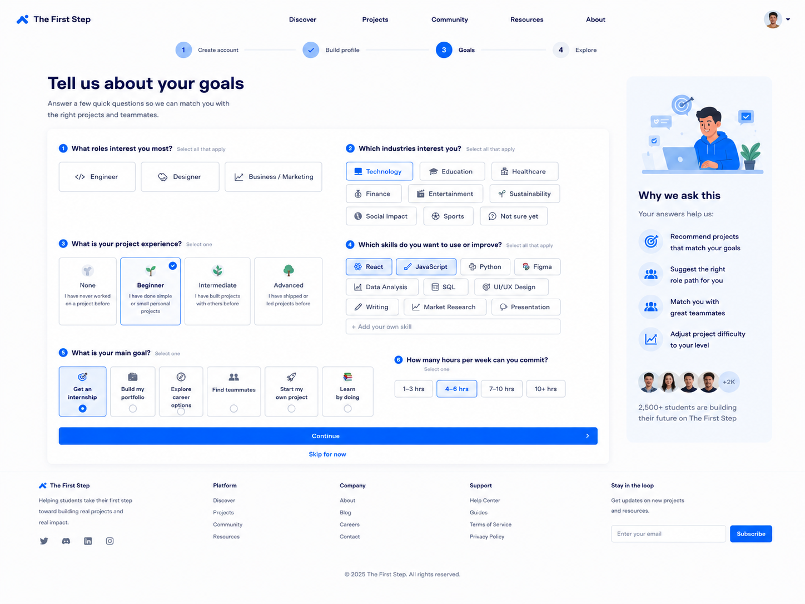

# Tell Us About Goals Page Handoff



## Features We Need on This Page

* Header / Navigation
* Onboarding progress indicator
* Main page title
* Role interest selector
* Industry interest selector
* Project experience selector
* Skills selector
* Main goal selector
* Weekly availability selector
* Continue CTA
* Skip option
* Explanation card
* Footer

---

## 1. Header / Navigation

### Needed elements

* Logo: The First Step
* Navigation links:

  * Discover
  * Projects
  * Community
  * Resources
  * About
* User avatar / account menu

### Notes

The header should stay consistent with the previous onboarding pages.

---

## 2. Onboarding Progress Indicator

### Needed elements

* Step 1: Create account
* Step 2: Build profile
* Step 3: Goals
* Step 4: Explore

### Notes

The current step should be visually highlighted.

For this page, `Goals` should be active.

---

## 3. Main Page Title

### Needed elements

* Main headline
* Short supporting text

### Suggested copy

Headline:

```text id="h0h1ha"
Tell us about your goals
```

Description:

```text id="0d4w75"
Answer a few quick questions so we can match you with the right projects and teammates.
```

---

## 4. Role Interest Selector

### Needed question

```text id="bw8jye"
What roles interest you most?
```

### Needed options

* Engineer
* Designer
* Business / Marketing

### Notes

This should allow selection from the 3 main role directions only.

---

## 5. Industry Interest Selector

### Needed question

```text id="0ef3tv"
Which industries interest you?
```

### Needed options

* Technology
* Education
* Healthcare
* Finance
* Entertainment
* Sustainability
* Social Impact
* Sports
* Not sure yet

### Notes

Users should be able to select multiple options.

---

## 6. Project Experience Selector

### Needed question

```text id="q5a8sa"
What is your project experience?
```

### Needed options

* None
* Beginner
* Intermediate
* Advanced

### Suggested helper text

* None — I have never worked on a project before
* Beginner — I have done simple tutorials or small personal projects
* Intermediate — I have built projects with others before
* Advanced — I have shipped or led projects before

### Notes

Only one option should be selected here.

---

## 7. Skills Selector

### Needed question

```text id="thijc0"
Which skills do you want to use or improve?
```

### Needed options

* React
* JavaScript
* Python
* Figma
* Data Analysis
* SQL
* UI/UX Design
* Writing
* Market Research
* Presentation

### Needed elements

* Skill option buttons
* Optional custom skill input

### Notes

Users should be able to select multiple skills.

---

## 8. Main Goal Selector

### Needed question

```text id="fag5rf"
What is your main goal?
```

### Needed options

* Get an internship
* Build my portfolio
* Explore career options
* Find teammates
* Start my own project
* Learn by doing

### Notes

Only one main goal should be selected.

---

## 9. Weekly Availability Selector

### Needed question

```text id="2c2rxo"
How many hours per week can you commit?
```

### Needed options

* 1–3 hrs
* 4–6 hrs
* 7–10 hrs
* 10+ hrs

### Notes

Only one option should be selected.

---

## 10. Continue CTA

### Needed elements

* Primary button

### Button text

```text id="n4tewf"
Continue
```

### Notes

After the user clicks this button, they should move to the Suggested Directions page.

---

## 11. Skip Option

### Needed elements

* Text link below the main CTA

### Link text

```text id="xxlk4b"
Skip for now
```

### Notes

This allows users to continue onboarding without fully completing this page.

---

## 12. Explanation Card

### Needed elements

* Illustration or simple visual
* Section title
* Short explanation list
* Social proof text

### Suggested title

```text id="v2b71b"
Why we ask this
```

### Benefit items

* Recommend projects that match your goals
* Suggest the right role path for you
* Match you with great teammates
* Adjust project difficulty to your level

### Social proof text

```text id="x6u9sz"
2,500+ students are building their future on The First Step
```

---

## 13. Footer

### Needed elements

* Logo
* Short product description
* Platform links
* Company links
* Support links
* Email subscribe input

---

## Design Direction for Tell Us About Goals Page

The Tell Us About Goals Page should feel:

* Clean
* Friendly
* Personalized
* Beginner-friendly
* Easy to answer
* Consistent with the onboarding flow

### Visual style

* White background
* Blue primary CTA
* Light blue accent shapes
* Rounded selection cards
* Clear question grouping
* Soft borders
* Simple icons
* Spacious layout
* Consistent with previous pages
