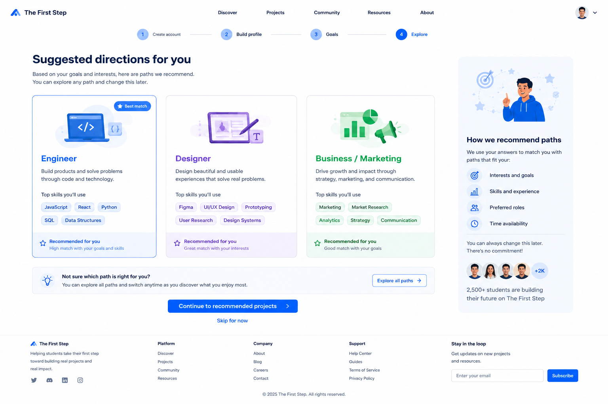

# Suggested Directions Page Handoff



## Features We Need on This Page

* Header / Navigation
* Onboarding progress indicator
* Main page title
* Suggested direction cards
* Best match badge
* Skill tags
* Recommendation reason
* Explore all paths option
* Continue CTA
* Skip option
* Explanation card
* Footer

---

## 1. Header / Navigation

### Needed elements

* Logo: The First Step
* Navigation links:

  * Discover
  * Projects
  * Community
  * Resources
  * About
* User avatar / account menu

### Notes

The header should stay consistent with the previous onboarding pages.

---

## 2. Onboarding Progress Indicator

### Needed elements

* Step 1: Create account
* Step 2: Build profile
* Step 3: Goals
* Step 4: Explore

### Notes

This page comes after the Goals page.

The current step should be visually highlighted as `Explore`.

---

## 3. Main Page Title

### Needed elements

* Main headline
* Short supporting text

### Suggested copy

Headline:

```text
Suggested directions for you
```

Description:

```text
Based on your goals and interests, here are paths we recommend. You can explore any path and change this later.
```

---

## 4. Suggested Direction Cards

### Needed cards

* Engineer
* Designer
* Business / Marketing

### Each card should include

* Role path name
* Illustration or icon
* Short description
* Top skills
* Recommendation reason
* Optional badge

### Notes

Each card should be clickable and should lead users toward related recommended projects.

---

## 5. Engineer Card

### Suggested copy

Title:

```text
Engineer
```

Description:

```text
Build products and solve problems through code and technology.
```

Top skills:

* JavaScript
* React
* Python
* SQL
* Data Structures

Recommendation reason:

```text
Recommended for you
High match with your goals and skills
```

---

## 6. Designer Card

### Suggested copy

Title:

```text
Designer
```

Description:

```text
Design beautiful and usable experiences that solve real problems.
```

Top skills:

* Figma
* UI/UX Design
* Prototyping
* User Research
* Design Systems

Recommendation reason:

```text
Recommended for you
Great match with your interests
```

---

## 7. Business / Marketing Card

### Suggested copy

Title:

```text
Business / Marketing
```

Description:

```text
Drive growth and impact through strategy, marketing, and communication.
```

Top skills:

* Marketing
* Market Research
* Analytics
* Strategy
* Communication

Recommendation reason:

```text
Recommended for you
Good match with your goals
```

---

## 8. Best Match Badge

### Needed elements

* Small badge on the strongest recommended card

### Suggested badge text

```text
Best match
```

### Notes

The best match should be visually highlighted with a blue border or blue badge.

---

## 9. Explore All Paths Option

### Needed elements

* Small info card
* Secondary CTA button

### Suggested copy

Title:

```text
Not sure which path is right for you?
```

Description:

```text
You can explore all paths and switch anytime as you discover what you enjoy most.
```

Button:

```text
Explore all paths
```

---

## 10. Continue CTA

### Needed elements

* Primary button

### Button text

```text
Continue to recommended projects
```

### Notes

After the user clicks this button, they should move to the Recommended Projects page.

---

## 11. Skip Option

### Needed elements

* Text link below the main CTA

### Link text

```text
Skip for now
```

---

## 12. Explanation Card

### Needed elements

* Illustration or simple visual
* Section title
* Short explanation list
* Social proof text

### Suggested title

```text
How we recommend paths
```

### Explanation items

* Interests and goals
* Skills and experience
* Preferred roles
* Time availability

### Supporting text

```text
You can always change this later. There is no commitment.
```

### Social proof text

```text
2,500+ students are building their future on The First Step
```

---

## 13. Footer

### Needed elements

* Logo
* Short product description
* Platform links
* Company links
* Support links
* Email subscribe input

---

## Design Direction for Suggested Directions Page

The Suggested Directions Page should feel:

* Personalized
* Encouraging
* Beginner-friendly
* Flexible
* Clean
* Easy to compare

### Visual style

* White background
* Blue primary CTA
* Light blue active state
* Rounded role cards
* Skill tags
* Soft borders
* Simple illustrations
* Clear recommendation labels
* Consistent with previous onboarding pages
