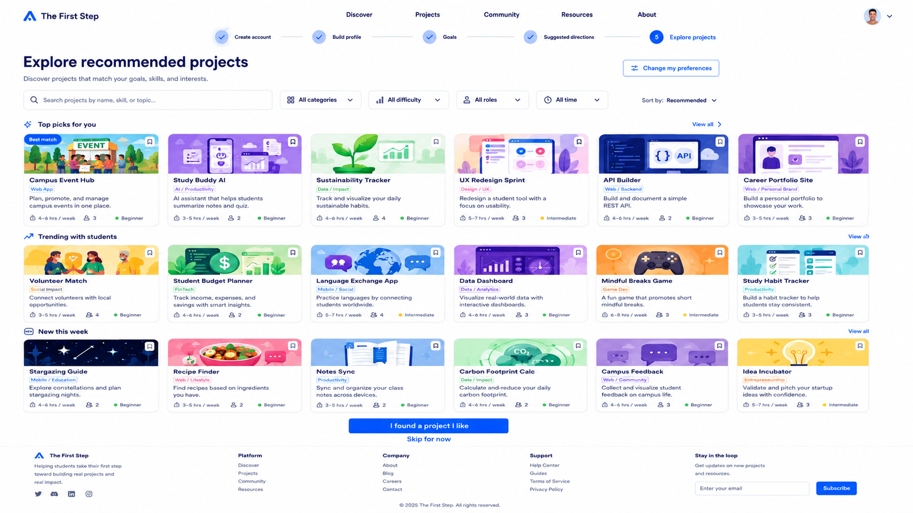

# Explore Recommended Projects Page Handoff


## Features We Need on This Page

* Header / Navigation
* Onboarding progress indicator
* Main page title
* Search bar
* Filter controls
* Sort option
* Project category sections
* Project cards
* Bookmark/save project icon
* Main CTA
* Skip option
* Footer

---

## 1. Header / Navigation

### Needed elements

* Logo: The First Step
* Navigation links:

  * Discover
  * Projects
  * Community
  * Resources
  * About
* User avatar / account menu

### Notes

The header should stay consistent with the previous onboarding pages.

---

## 2. Onboarding Progress Indicator

### Needed elements

* Step 1: Create account
* Step 2: Build profile
* Step 3: Goals
* Step 4: Suggested directions
* Step 5: Explore projects

### Notes

The current step should be visually highlighted.

For this page, `Explore projects` should be active.

---

## 3. Main Page Title

### Needed elements

* Main headline
* Short supporting text

### Suggested copy

Headline:

```text
Explore recommended projects
```

Description:

```text
Discover projects that match your goals, skills, and interests.
```

---

## 4. Search Bar

### Needed elements

* Search input
* Search icon
* Placeholder text

### Suggested placeholder

```text
Search projects by name, skill, or topic...
```

### Notes

Search should help users quickly find projects by keyword, skill, or topic.

---

## 5. Filter Controls

### Needed filters

* Category
* Difficulty
* Role
* Time commitment

### Suggested labels

* All categories
* All difficulty
* All roles
* All time

### Notes

Filters should be simple dropdowns.

For the first version, these can be static UI elements if filtering is not implemented yet.

---

## 6. Sort Option

### Needed elements

* Sort dropdown

### Suggested options

* Recommended
* Most popular
* Newest
* Beginner friendly
* Shortest time commitment

### Notes

Default sort should be `Recommended`.

---

## 7. Project Category Sections

### Needed sections

* Top picks for you
* Trending with students
* New this week

### Notes

Projects should be shown in a grid layout, similar to a discovery/browsing experience.

The page should feel like users can browse many project options, not just a small recommendation list.

---

## 8. Project Cards

### Needed fields

Each project card should include:

* Project image
* Project title
* Category tag
* Short description
* Time commitment
* Team size or number of people
* Difficulty level
* Bookmark/save icon

### Example projects

* Campus Event Hub
* Study Buddy AI
* Sustainability Tracker
* UX Redesign Sprint
* API Builder
* Career Portfolio Site
* Volunteer Match
* Student Budget Planner
* Language Exchange App
* Data Dashboard
* Mindful Breaks Game
* Study Habit Tracker
* Stargazing Guide
* Recipe Finder
* Notes Sync
* Carbon Footprint Calculator
* Campus Feedback
* Idea Incubator

### Notes

Project cards should be compact and easy to scan.

The layout should show multiple projects at once, similar to a project marketplace or discovery page.

---

## 9. Bookmark / Save Project Icon

### Needed elements

* Small bookmark icon on each project card

### Notes

This lets users save projects they are interested in.

For the first version, this can be visual only.

---

## 10. Main CTA

### Needed elements

* Primary button

### Button text

```text
I found a project I like
```

### Notes

After the user clicks this button, they should move to the next onboarding step.

---

## 11. Skip Option

### Needed elements

* Text link below the main CTA

### Link text

```text
Skip for now
```

---

## 12. Footer

### Needed elements

* Logo
* Short product description
* Platform links
* Company links
* Support links
* Email subscribe input

---

## Design Direction for Explore Recommended Projects Page

The Explore Recommended Projects Page should feel:

* Fun to browse
* Project-focused
* Beginner-friendly
* Clean
* Motivating
* Easy to scan

### Visual style

* White background
* Blue primary CTA
* Light blue active states
* Compact project cards
* Rounded card corners
* Colorful project thumbnails
* Clear category labels
* Grid-based layout
* Similar to a project discovery marketplace
* Consistent with previous onboarding pages
