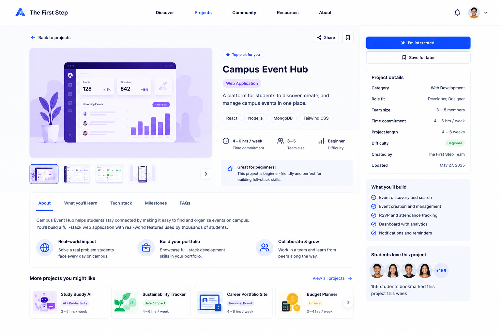

# Project Detail Page Handoff



## Features We Need on This Page

* Header / Navigation
* Back to projects link
* Project hero / preview section
* Project title and summary
* Project tags
* Project key stats
* Project gallery / preview thumbnails
* Project detail tabs
* Project overview section
* What you’ll build section
* Skills / tech stack section
* Related projects section
* Action sidebar
* Project details card
* Save project option
* Share option

---

## 1. Header / Navigation

### Needed elements

* Logo: The First Step
* Navigation links:

  * Discover
  * Projects
  * Community
  * Resources
  * About
* Notification icon
* User avatar / account menu

### Notes

The header should stay consistent with the previous pages.

---

## 2. Back to Projects Link

### Needed elements

* Back arrow
* Text link

### Suggested copy

```text
Back to projects
```

### Notes

This should take the user back to the Explore Recommended Projects page.

---

## 3. Project Hero / Preview Section

### Needed elements

* Large project preview image
* Small preview thumbnails
* Optional carousel arrow

### Notes

The large image should show what the project could look like or what the final output might be.

The thumbnails can show different screens or project examples.

---

## 4. Project Title and Summary

### Needed elements

* Project title
* Category tag
* Short project description
* Skill tags

### Suggested example

Title:

```text
Campus Event Hub
```

Category:

```text
Web Application
```

Description:

```text
A platform for students to discover, create, and manage campus events in one place.
```

Skill tags:

* React
* Node.js
* MongoDB
* Tailwind CSS

---

## 5. Project Key Stats

### Needed elements

* Time commitment
* Team size
* Difficulty

### Example values

* Time commitment: 4–6 hrs / week
* Team size: 3–5
* Difficulty: Beginner

### Notes

These should be easy to scan near the project summary.

---

## 6. Recommendation Note

### Needed elements

* Small highlighted recommendation card

### Suggested copy

```text
Great for beginners!
This project is beginner-friendly and perfect for building full-stack skills.
```

### Notes

This helps users understand why the project is recommended.

---

## 7. Project Detail Tabs

### Needed tabs

* About
* What you’ll learn
* Tech stack
* Milestones
* FAQs

### Notes

The active tab should be visually highlighted.

For the first version, only the About tab needs to be fully shown.

---

## 8. About / Overview Section

### Needed elements

* Short overview paragraph
* Value points

### Suggested copy

```text
Campus Event Hub helps students stay connected by making it easy to find and organize events on campus. You’ll build a full-stack web application with real-world features used by student communities.
```

### Suggested value points

* Real-world impact
* Build your portfolio
* Collaborate and grow

---

## 9. What You’ll Build Section

### Needed elements

* Checklist of project deliverables

### Example items

* Event discovery and search
* Event creation and management
* RSVP and attendance tracking
* Dashboard with analytics
* Notifications and reminders

---

## 10. Skills / Tech Stack Section

### Needed elements

* Skill tags
* Tools / technology tags

### Example skills

* React
* Node.js
* MongoDB
* Tailwind CSS
* UI/UX
* Authentication
* Dashboard design

### Notes

This section helps users know what they will practice.

---

## 11. Action Sidebar

### Needed elements

* Primary CTA button
* Save for later button

### Primary CTA text

```text
I'm interested
```

Alternative CTA:

```text
I want to build this
```

### Secondary CTA text

```text
Save for later
```

### Notes

The primary CTA should be visually strongest.

Clicking the primary CTA should move the user toward joining or starting the project.

---

## 12. Project Details Card

### Needed fields

* Category
* Role fit
* Team size
* Time commitment
* Project length
* Difficulty
* Created by
* Updated date

### Example values

* Category: Web Development
* Role fit: Developer, Designer
* Team size: 3–5 members
* Time commitment: 4–6 hrs / week
* Project length: 4–6 weeks
* Difficulty: Beginner
* Created by: The First Step Team
* Updated: May 27, 2025

---

## 13. Students Love This Project Card

### Needed elements

* Student avatar group
* Bookmark / interest count
* Short social proof text

### Suggested copy

```text
156 students bookmarked this project this week
```

---

## 14. Related Projects Section

### Needed elements

* Small related project cards
* View all projects link

### Example projects

* Study Buddy AI
* Sustainability Tracker
* Career Portfolio Site
* Budget Planner

### Notes

This section helps users keep browsing if this project is not the right fit.

---

## Design Direction for Project Detail Page

The Project Detail Page should feel:

* Informative
* Clear
* Trustworthy
* Beginner-friendly
* Project-focused
* Easy to act on

### Visual style

* White background
* Blue primary CTA
* Large project preview image
* Rounded cards
* Clean sidebar
* Clear tags and stats
* Easy-to-scan sections
* Consistent with the Explore Recommended Projects page
