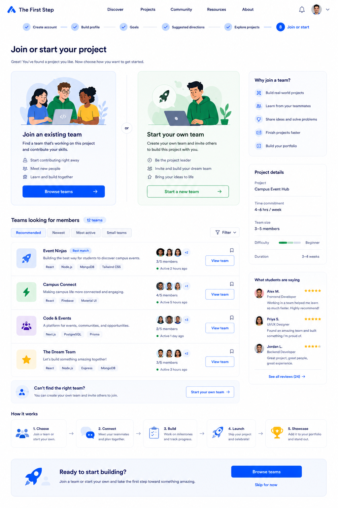

# Join or Start Project Page Handoff



## Features We Need on This Page

* Header / Navigation
* Onboarding progress indicator
* Main page title
* Join existing team option
* Start your own team option
* Teams looking for members list
* Team cards
* Filter / category controls
* Project details sidebar
* Student reviews / social proof
* How it works section
* Final CTA section
* Skip option

---

## 1. Header / Navigation

### Needed elements

* Logo: The First Step
* Navigation links:

  * Discover
  * Projects
  * Community
  * Resources
  * About
* Notification icon
* User avatar / account menu

### Notes

The header should stay consistent with the previous pages.

---

## 2. Onboarding Progress Indicator

### Needed elements

* Step 1: Create account
* Step 2: Build profile
* Step 3: Goals
* Step 4: Suggested directions
* Step 5: Explore projects
* Step 6: Project detail
* Step 7: Join or start

### Notes

The current step should be visually highlighted.

For this page, `Join or start` should be active.

---

## 3. Main Page Title

### Needed elements

* Main headline
* Short supporting text

### Suggested copy

Headline:

```text
Join or start your project
```

Description:

```text
Great! You've found a project you like. Now choose how you want to get started.
```

---

## 4. Join Existing Team Option

### Needed elements

* Illustration
* Option title
* Short description
* Benefit list
* Primary button

### Suggested copy

Title:

```text
Join an existing team
```

Description:

```text
Find a team that's already working on this project and contribute your skills.
```

Benefit items:

* Start contributing right away
* Meet new people
* Learn and build together

Button:

```text
Browse teams
```

---

## 5. Start Your Own Team Option

### Needed elements

* Illustration
* Option title
* Short description
* Benefit list
* Secondary button

### Suggested copy

Title:

```text
Start your own team
```

Description:

```text
Create your own team and invite others to build this project with you.
```

Benefit items:

* Be the project leader
* Invite and build your dream team
* Bring your ideas to life

Button:

```text
Start a new team
```

---

## 6. Teams Looking for Members Section

### Needed elements

* Section title
* Team count badge
* Category tabs
* Filter button
* Team cards

### Suggested category tabs

* Recommended
* Newest
* Most active
* Small teams

### Notes

This section helps users browse teams that are currently open to new members.

---

## 7. Team Cards

### Needed fields

Each team card should include:

* Team icon or thumbnail
* Team name
* Short description
* Skill / tech tags
* Current team members
* Open spots or member count
* Recent activity status
* Save/bookmark icon
* View team button

### Example teams

* Event Ninjas
* Campus Connect
* Code & Events
* The Dream Team

### Example fields

```text
3/5 members
Active 2 hours ago
```

Button:

```text
View team
```

---

## 8. Can't Find the Right Team Card

### Needed elements

* Small callout card
* Short explanation
* CTA button

### Suggested copy

Title:

```text
Can't find the right team?
```

Description:

```text
You can create your own team and invite others to join.
```

Button:

```text
Start your own team
```

---

## 9. Project Details Sidebar

### Needed elements

* Project name
* Time commitment
* Team size
* Difficulty
* Duration

### Example values

* Project: Campus Event Hub
* Time commitment: 4–6 hrs / week
* Team size: 3–5 members
* Difficulty: Beginner
* Duration: 3–4 weeks

### Notes

This helps users remember what project they are choosing a team for.

---

## 10. Why Join a Team Card

### Needed elements

* Section title
* Short benefit list

### Suggested title

```text
Why join a team?
```

Benefit items:

* Build real-world projects
* Learn from your teammates
* Share ideas and solve problems
* Finish projects faster
* Build your portfolio

---

## 11. Student Reviews / Social Proof

### Needed elements

* Student avatar
* Student name
* Role
* Short review text
* Rating stars
* See all reviews link

### Notes

This section helps build trust and motivation.

---

## 12. How It Works Section

### Needed steps

1. Choose
2. Connect
3. Build
4. Launch
5. Showcase

### Suggested short descriptions

* Choose: Join a team or start your own.
* Connect: Meet your teammates and plan together.
* Build: Work on milestones and track progress.
* Launch: Ship your project and celebrate.
* Showcase: Add it to your portfolio and stand out.

---

## 13. Final CTA Section

### Needed elements

* Short headline
* Short supporting text
* Primary CTA button
* Skip option

### Suggested copy

Headline:

```text
Ready to start building?
```

Description:

```text
Join a team or start your own and take the first step toward something amazing.
```

Button:

```text
Browse teams
```

Skip link:

```text
Skip for now
```

---

## Design Direction for Join or Start Project Page

The Join or Start Project Page should feel:

* Encouraging
* Action-oriented
* Collaborative
* Beginner-friendly
* Clear
* Trustworthy

### Visual style

* White background
* Blue primary CTA
* Green accent for starting a team
* Rounded option cards
* Clear team cards
* Soft borders
* Student avatars
* Simple icons
* Spacious layout
* Consistent with previous onboarding pages
