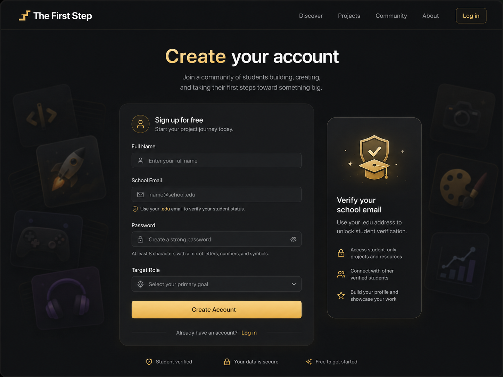
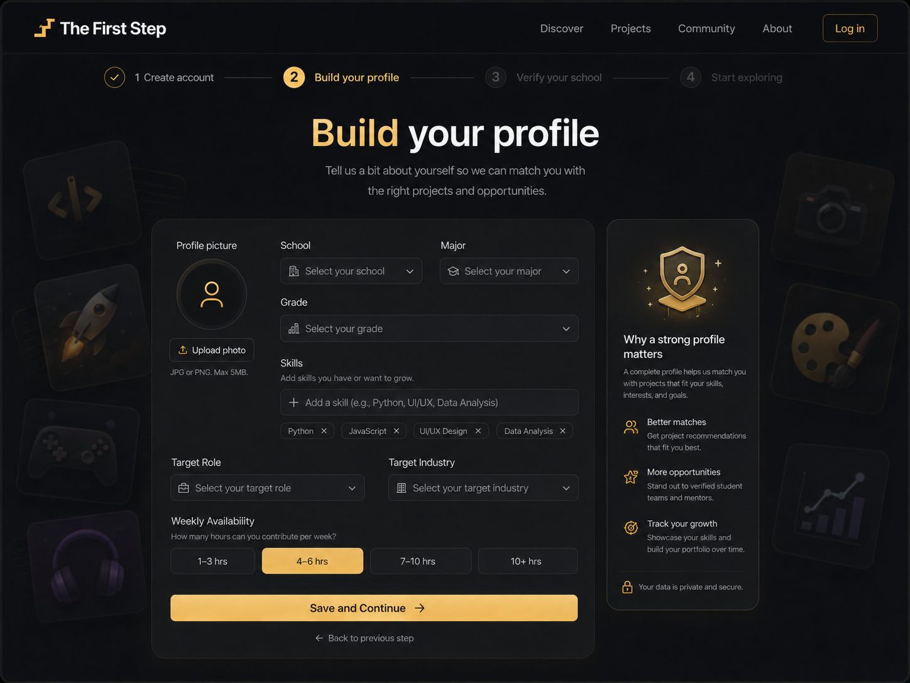
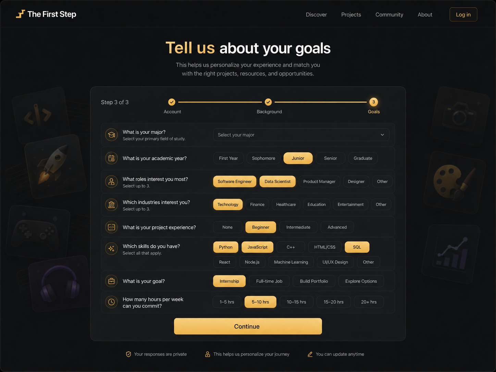
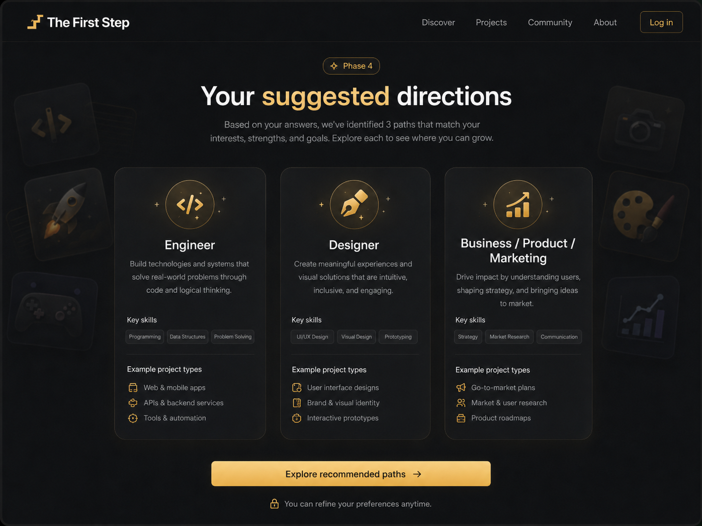
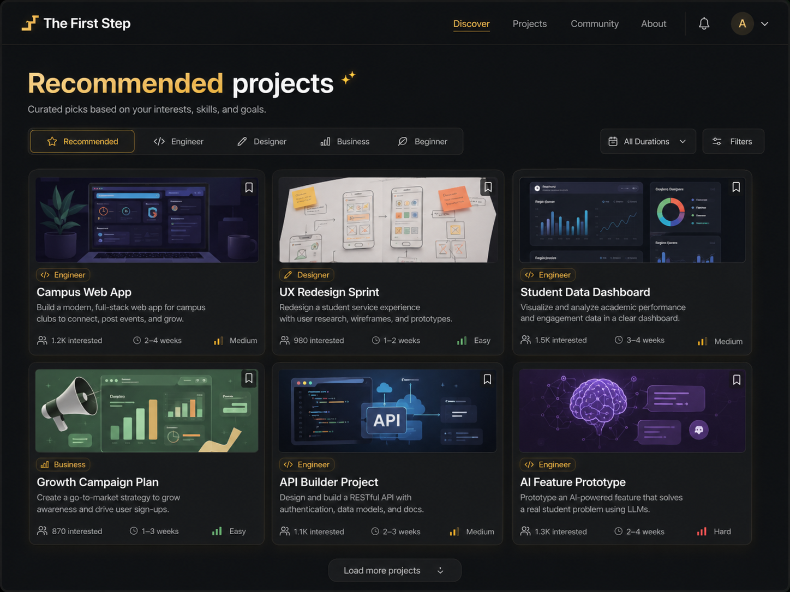
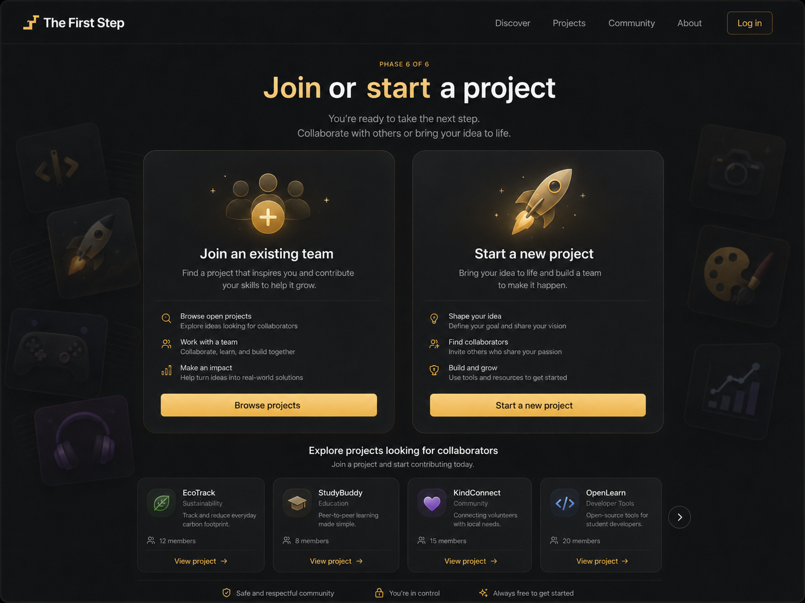
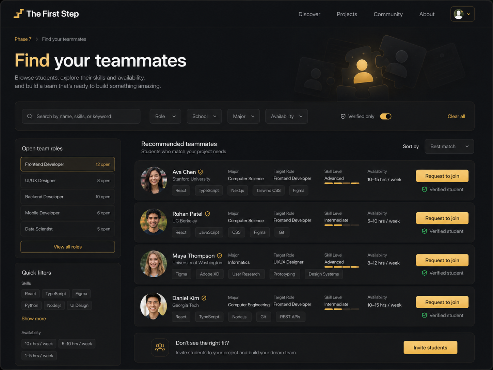
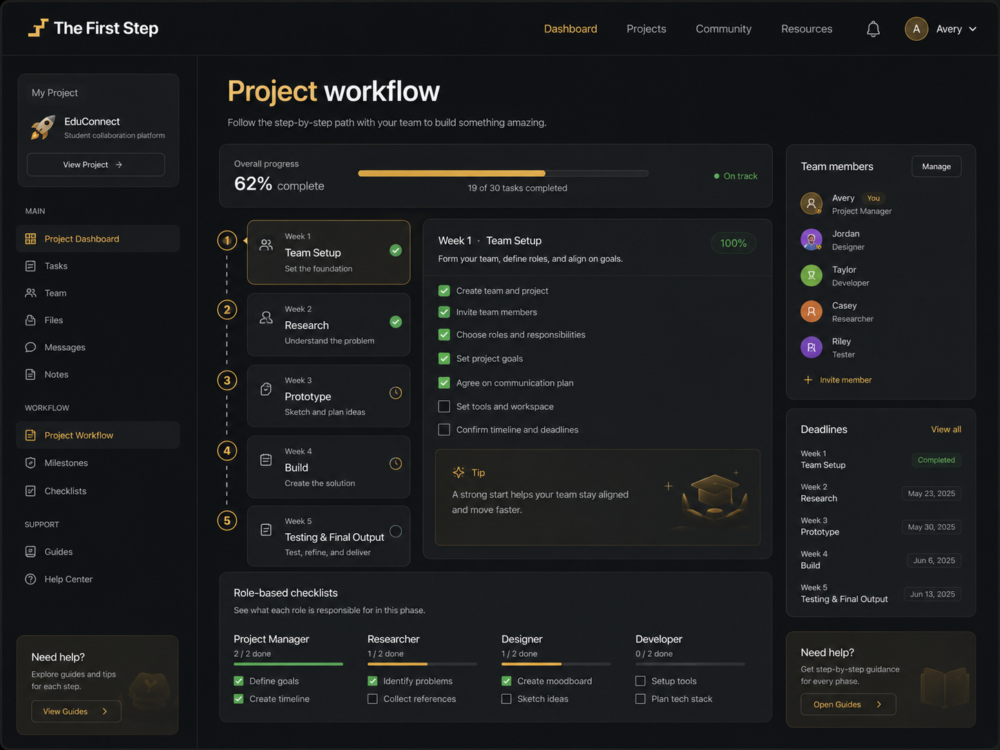

# MVP UX Flow: The First Step

## 1. Purpose

The First Step is a platform that helps students find beginner-friendly team projects, join or create teams, find teammates, and follow a guided project workflow.

---

## 2. Core UX Goal

The main UX goal is to guide the user from:

```txt
"I want to build something, but I don't know where to start."
```

to:

```txt
"I found a project, joined or created a team, and now I know exactly what to do next."
```

---

## 3. High-Level User Journey

```txt
Create Account
↓
Build Profile
↓
Tell Us About Goals
↓
See Suggested Directions
↓
Explore Recommended Projects
↓
Join or Start a Project
↓
Find Teammates
↓
Follow Project Workflow
```

---

# 4. UX Flow Overview

## Phase 1: Create Account



### User Goal

Create a student account and enter the platform.

### UX Purpose

The user should quickly understand that this is a student-focused platform where they can safely start their project journey.

### Main UI Elements

* Full name input
* School email input
* Password input
* Target role dropdown
* Create Account button
* Login link
* Trust indicators:

  * Student verified
  * Data secure
  * Free to get started

### Primary Action

Create Account

### Next Step

Build Profile

---

## Phase 2: Build Profile



### User Goal

Provide background information so the platform can recommend better projects and teammates.

### UX Purpose

The profile helps match users with projects, roles, teammates, and learning paths.

### Main UI Elements

* Profile picture upload
* School dropdown
* Major dropdown
* Grade dropdown
* Skills input
* Skill tags
* Target role dropdown
* Target industry dropdown
* Weekly availability selector
* Save and Continue button

### Primary Action

Save and Continue

### Next Step

Tell Us About Goals

---

## Phase 3: Tell Us About Goals



### User Goal

Share interests, experience level, skills, and availability.

### UX Purpose

This step personalizes the user’s journey and helps the platform recommend suitable directions and projects.

### Main UI Elements

* Major selection
* Academic year selection
* Role interest selection
* Industry interest selection
* Project experience level
* Skills selection
* Goal selection
* Weekly time commitment selection
* Continue button

### Primary Action

Continue

### Next Step

Suggested Directions

---

## Phase 4: Suggested Directions



### User Goal

Understand which project paths fit their interests and goals.

### UX Purpose

Instead of forcing users to choose from a blank page, the platform gives them recommended directions.

### Main UI Elements

* Recommended path cards:

  * Engineer
  * Designer
  * Business / Product / Marketing
* Key skills for each path
* Example project types
* Explore recommended paths button

### Primary Action

Explore recommended paths

### Next Step

Recommended Projects

---

## Phase 5: Recommended Projects



### User Goal

Find a beginner-friendly project that matches their role, skills, interests, and goals.

### UX Purpose

This screen helps users discover structured project opportunities without feeling overwhelmed.

### Main UI Elements

* Project category tabs
* Duration filter
* General filters
* Project cards
* Load more projects button

### Project Card Elements

Each project card should show:

* Project image
* Project title
* Role category
* Short description
* Number of interested users
* Duration
* Difficulty level
* Save/bookmark icon

### Primary Action

Click a project card

### Next Step

Join or Start a Project

---

## Phase 6: Join or Start a Project



### User Goal

Decide whether to join an existing team or start a new project.

### UX Purpose

The platform supports both users who want to contribute to an existing project and users who already have an idea.

### Main Options

#### Option 1: Join an Existing Team

User can:

* Browse open projects
* Explore ideas looking for collaborators
* Work with a team
* Make an impact

Primary CTA:

```txt
Browse projects
```

#### Option 2: Start a New Project

User can:

* Shape their idea
* Find collaborators
* Build and grow

Primary CTA:

```txt
Start a new project
```

### Primary Action

Choose one path

### Next Step

Find Teammates or Create Project Flow

---

## Phase 7: Find Teammates



### User Goal

Find students who match the project’s role needs, skills, availability, and interests.

### UX Purpose

This screen helps users form a team without relying only on existing friends or networks.

### Main UI Elements

* Search bar
* Role filter
* School filter
* Major filter
* Availability filter
* Verified-only toggle
* Open team roles sidebar
* Quick filters
* Recommended teammate list
* Request to join button
* Invite students button

### Primary Action

Request to join or invite students

### Next Step

Project Workflow

---

## Phase 8: Project Workflow



### User Goal

Understand what to do each week and make progress with the team.

### UX Purpose

This is the core guided experience. It prevents users from getting stuck after joining a project.

### Main UI Elements

* Project sidebar
* Overall progress bar
* Weekly workflow steps
* Checklist for current week
* Team members panel
* Deadlines panel
* Role-based checklists
* Help / guides section

### Weekly Workflow

```txt
Week 1: Team Setup
Week 2: Research
Week 3: Prototype
Week 4: Build
Week 5: Testing & Final Output
```

### Primary Action

Complete weekly tasks

### Final MVP Outcome

The user has:

* Created an account
* Built a profile
* Found a recommended direction
* Explored projects
* Joined or started a project
* Found teammates
* Started following a structured workflow

---

# 5. MVP Screen List

```txt
1. Create Account
2. Build Profile
3. Tell Us About Goals
4. Suggested Directions
5. Recommended Projects
6. Join or Start a Project
7. Find Teammates
8. Project Workflow
```

---

# 6. MVP Core User Flow

```txt
User creates account
↓
User builds profile
↓
User answers goal questions
↓
Platform recommends directions
↓
User explores recommended projects
↓
User joins or starts a project
↓
User finds teammates
↓
User follows weekly workflow
```

